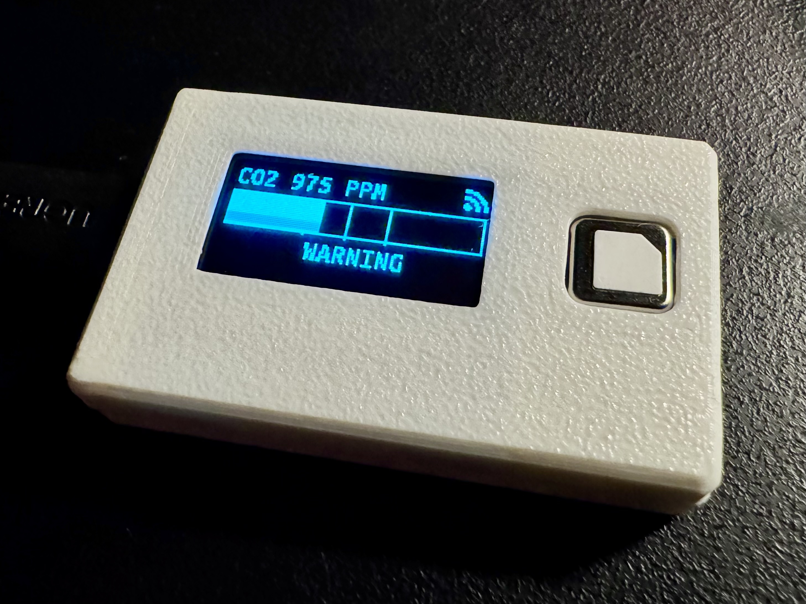
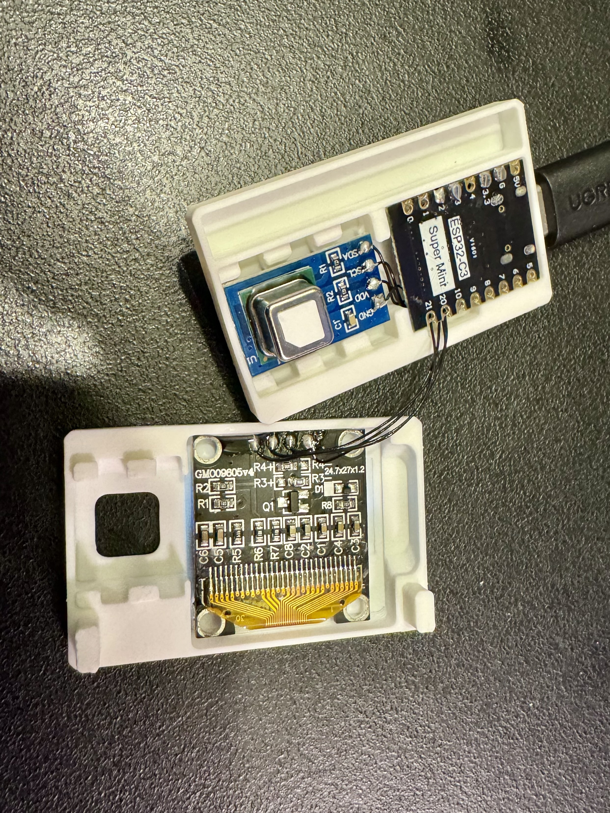
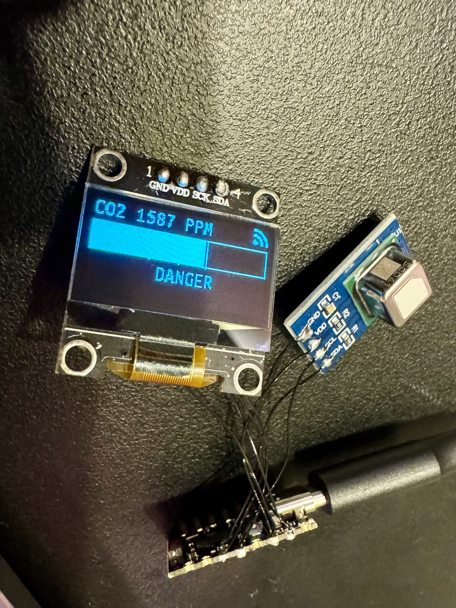

# ESPHOME ESP32-C3 Super Mini CO2 OLED Sensor

This project is designed to monitor indoor air quality by measuring CO₂ levels using a Sensirion [SDC41](https://www.sensirion.com/en/environmental-sensors/industrial-co2-sensor-sdc41/) sensor. The system is built on an [ESP32-C3 Super Mini](https://www.espboards.dev/esp32/esp32-c3-super-mini/) board running ESPHome firmware. Sensor data (CO₂, temperature, and humidity) is displayed in real time on an [OLED 128×64 display](https://www.aliexpress.com/item/32896971385.html) that shows a top-line reading, a Wi‑Fi connectivity icon, a bar indicator for CO₂ levels, a status word, and a small tag in the lower left corner.

## Features

- **CO₂, Temperature, and Humidity Monitoring:**  
  Uses the Sensirion SDC41 sensor to accurately measure indoor air quality.
  
- **OLED Display:**  
  Displays:
  - The current CO₂ value in large text at the top.
  - A 12×12 Wi‑Fi icon in the top right indicating network connectivity.
  - A bar indicator representing CO₂ levels relative to configurable thresholds.
  - A status word ("SAFE", "WARNING", "DANGER", "CRITICAL") based on sensor readings.
  - A small tag (defined via configuration substitutions) in the bottom left corner.

- **Configurable Thresholds and Home Assistant Integration:**  
  Thresholds for safe, warning, dangerous, and critical levels can be adjusted via Home Assistant. Other settings (such as brightness) may also be updated remotely.

- **3D Printed Case:**  
  The project includes a custom 3D printed case. STEP files for the case are available in the repository at:  
  `3d_models/ESPHOME-ESP32C3-CO2-OLED-Sensor_Case_Top_Bottom.step`

## Hardware Connections
  The idea behind this project was that anyone can put this together with basic soldering and 3d printing skills - there is no PCB there, only isolated fly-wires, as the wiring requires linking:
  - I2C interface (SDA Software I2C uses GPIO02 on ESP32, SCL Software I2C uses GPIO03 on ESP32)
  - 3.3v
  - GND

- **ESP32-C3 Super Mini Board:**  
  - **I2C Bus:**  
    - **SDA:** Connected to GPIO2  
    - **SCL:** Connected to GPIO3
  - **OLED Display:** Connected via I2C (address 60)
  - **SDC41 Sensor:** Connected via I2C (address 0x62)
  - **LED Output:** Connected to GPIO8 for status indication

- **Sensirion SDC41 CO₂ Sensor:**  
  A high-precision sensor for CO₂, temperature, and humidity that communicates over I2C.

- **OLED 128×64 SSD1306 Display:**  
  A common display module that uses the SSD1306 driver over I2C.

## Configuration Secrets and Tag

Before deploying the firmware, configure the following secrets in your ESPHome secrets file:

- **API Password:**  
  `api_password` – Used for API encryption.

- **OTA Password:**  
  `ota_password` – Required for over-the-air firmware updates.

- **WiFi Credentials:**  
  - `wifi_ssid` – Your WiFi network name.
  - `wifi_password` – Your WiFi network password.
  - `wifi_fallback_password` – Device fallback password.

Additionally, set the following substitution:

- **Tag:**  
  `tag` – For example, set to `pr` (or your preferred identifier). This is used in the device name and description:
  - `name: sg-co2-v2-${tag}`
  - `device_description: "SG SDC41 CO2 Sensor V2 ${tag}"`

## Useful Links

- [Sensirion SDC41 CO₂ Sensor](https://www.sensirion.com/en/environmental-sensors/industrial-co2-sensor-sdc41/)
- [ESP32-C3 Super Mini Board](https://www.espboards.dev/esp32/esp32-c3-super-mini/)
- [SSD1306 OLED Display Module](https://www.aliexpress.com/item/32896971385.html)

## Project Photos

### Open Case

### No Case

## License

This project is licensed under the GNU General Public License v3.0. See the [LICENSE](LICENSE) file for details.
